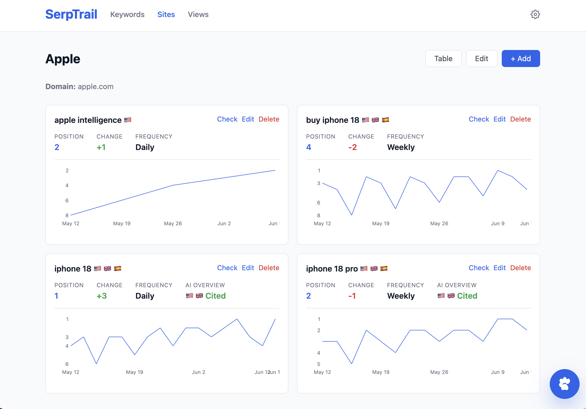

# SerpTrail

SerpTrail is a self-hosted SEO and GEO rank tracker built with Ruby on Rails and SQLite. It tracks Google organic positions and AI Overview citations while preserving historical search results for later analysis.



## Features

Here are the main SerpTail features:

- Track multiple websites, keywords, and locations
- Check rankings daily, weekly, biweekly, or monthly
- Search up to five pages of Google results
- Preserve historical Google results and ranking positions
- Track whether a website is cited in Google AI Overviews
- Attach multiple websites to the same keyword without repeating the search
- Compare historical performance using saved views
- Ask questions about historical data and rankings through the OpenAI-powered chat assistant
- Estimate monthly SerpApi credit usage from your current configuration

## How SerpTrail works

### Keywords and websites

Keywords and websites are tracked independently. A keyword defines:

- Search query
- Locations
- Check frequency
- Search depth

One Google search is performed for each keyword, location, and requested results page. The returned results are then checked against every website attached to that keyword. Attaching another website therefore does not increase SerpApi usage and is possible retroactively.

### Multi-page Google results

You can configure search depth from one to five pages for each keyword. A single `SearchRun` represents a keyword and location check. Each requested Google page is stored separately as a `SearchRunPage`, including its SerpApi search ID, response, offset, and status. Each page contains up to 10 organic results from Google:

| Search depth | Positions checked | SerpApi credits per location |
| --- | --- | --- |
| 1 page | 1–10 | 1 |
| 2 pages | 1–20 | 2 |
| 3 pages | 1–30 | 3 |
| 4 pages | 1–40 | 4 |
| 5 pages | 1–50 | 5 |

Positions from later pages are normalized into one continuous ranking. For example, the first organic result on page two is saved as position 11.

### GEO and AI Overviews

In addition to traditional organic rankings, SerpTrail records Google AI Overview data and checks whether tracked websites appear among its cited sources. This helps monitor both conventional SEO visibility and visibility within AI-generated search answers. This happens automatically as this information is extracted from a regular Google search.

### Scheduling

Keyword checks are scheduled automatically using Solid Queue. The `KeywordCheckDispatchJob` job runs every hour and selects keywords whose last check is older than their configured frequency. It then enqueues one `KeywordCheckJob` for every configured location.

Each job requests the configured number of Google result pages and stores them under a single search run. After the check completes, `last_checked_at` is updated and the next check is scheduled according to the keyword's frequency.

### Historical performance

Every search is stored independently from the websites being tracked. This allows SerpTrail to display historical organic results, track ranking changes for multiple websites, attach multiple websites without duplicating searches, and compare keywords and websites through saved views. It also allows you to analyze collected search data through the chat assistant.

### Chat assistant

When an OpenAI API key is configured, the built-in assistant can answer questions using SerpTrail's ranking history and live search tools. Chat responses support Markdown formatting, and token and cost information is tracked through RubyLLM's native chat interface.

### SerpApi credit usage

Each requested page consumes one SerpApi credit per keyword and location. For example, a keyword configured with two locations, three result pages, and daily checking uses approximately:

```text
2 locations × 3 pages × 30 checks = 180 credits per month
```

Adding more websites to an existing keyword does not increase usage because the search results are shared. The Settings page estimates total monthly usage.

## Requirements

SerpTrail is pretty minimal project. You can host it on any platform that supports Ruby on Rails and SQLite. You can use the attached Dockerfile to build a containerized version or use the official prebuilt image from Docker Hub. For actual tracking you'll need a SerpApi key and optionally also an OpenAI key for the chat assistant.

## Contributing

Contributions are welcome! Open an issue or a pull request.

Built by [SerpApi](https://serpapi.com).
